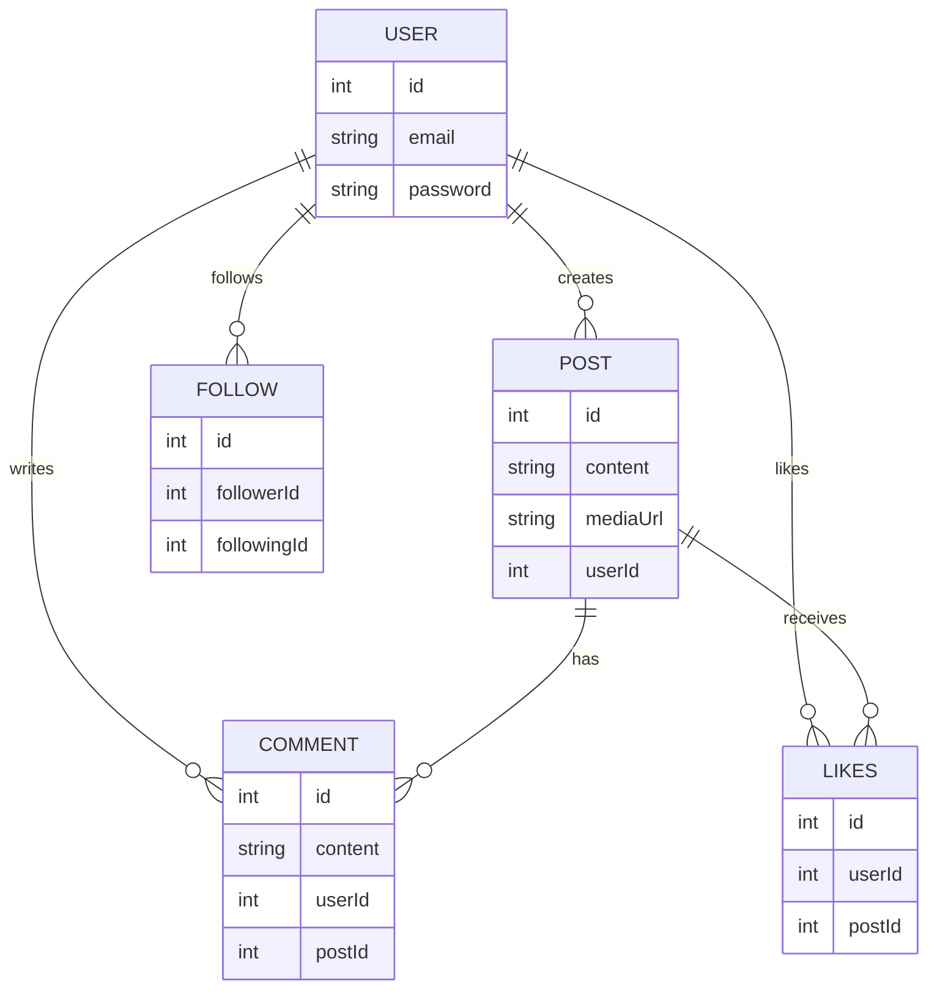

# Social Media Backend

# ER-Diagram :



## 📌 Project Overview
This is a **social media backend** built using **TypeScript, Express, and TypeORM**. It provides APIs for user authentication, post creation, liking posts, commenting on posts, following and unfollowing users, and more. The project is structured with best practices and includes **Swagger documentation** for easy API reference.

## 🚀 Features
- **User Authentication** (Signup & Login)
- **Post Creation** (With optional media uploads)
- **Like Posts**
- **Comment on Posts**
- **Follow & Unfollow Users**
- **JWT Authentication**
- **API Documentation** with Swagger [Swagger Docs](http://localhost:4000/api-docs)

---

## 🏗️ Tech Stack
- **Node.js** (Runtime)
- **Express.js** (Web framework)
- **TypeScript** (Type safety)
- **TypeORM** (Database ORM)
- **PostgreSQL** (Database)
- **Multer** (File Uploads)
- **JWT** (Authentication)
- **Swagger** (API Documentation)

---

## ⚙️ Installation & Setup

### 1️⃣ Clone the Repository
```sh
git clone https://github.com/your-repo/social-media-backend.git
cd social-media-backend
```

### 2️⃣ Install Dependencies
```sh
npm install
```

### 3️⃣ Setup Environment Variables
Create a `.env` file in the root directory and add the required environment variables:
```env
JWT_SECRET = secret
PORT = PORT
USERNAME = ""
PASSWORD = your pass
DATABASE = your db
DB_PORT = PORT

MAIL_PORT = 587
MAIL_HOST = hostname
MAIL_USER =email
MAIL_PASS = app pass
```


### 5️⃣ Start the Server
```sh
npm run dev
```
The server will be running at **`http://localhost:4000`**.

---

## 🔥 API Endpoints

### 🟢 Authentication
| Method | Endpoint      | Description |
|--------|--------------|-------------|
| POST   | `/auth/signup` | Register a new user |
| POST   | `/auth/login`  | User login |

### 🟢 Post Management
| Method | Endpoint      | Description |
|--------|--------------|-------------|
| POST   | `/post/create-post` | Create a new post with optional media |
| POST   | `/post/like-post`   | Like a post |
| POST   | `/post/comment`     | Comment on a post |

### 🟢 User Management
| Method | Endpoint         | Description |
|--------|-----------------|-------------|
| POST   | `/user/follow-user`   | Follow a user |
| POST   | `/user/unfollow-user` | Unfollow a user |

---

## 📜 API Documentation
Swagger documentation is available at: [Swagger Docs](http://localhost:4000/api-docs)


---

## 📜 License
This project is licensed under the **MIT License**.

